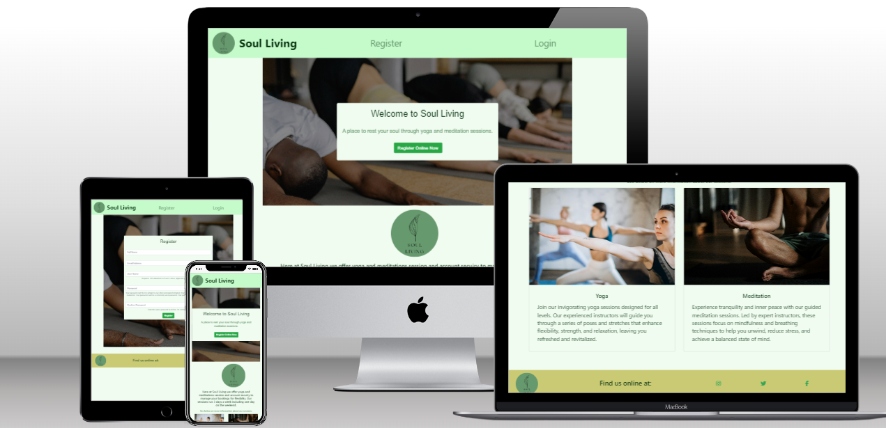
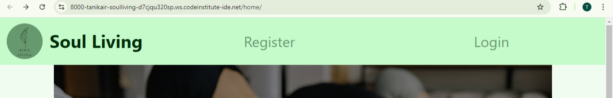
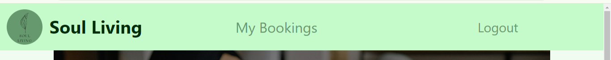
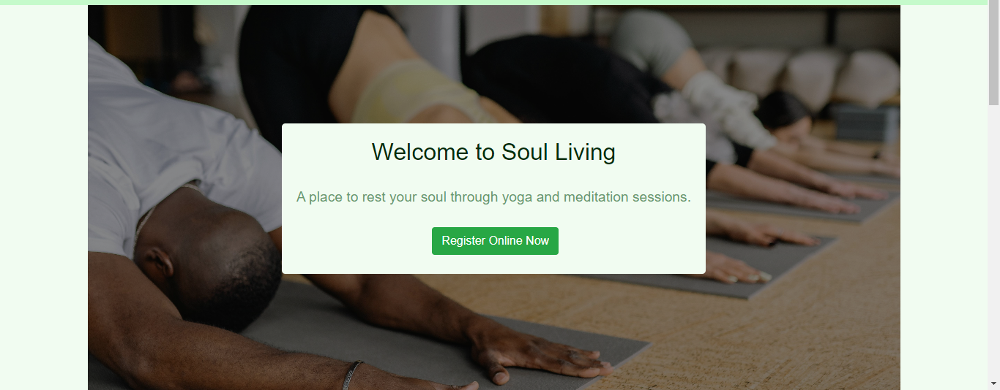
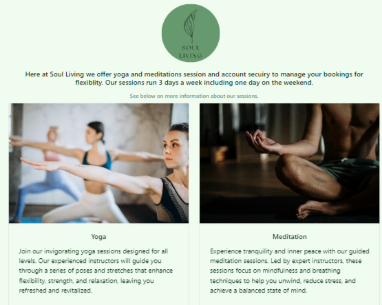
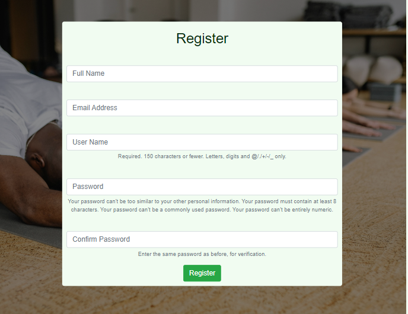
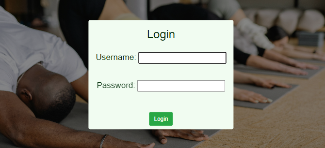
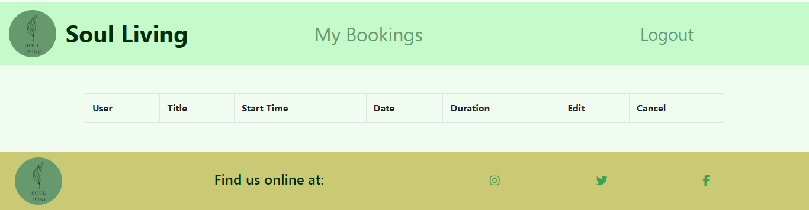
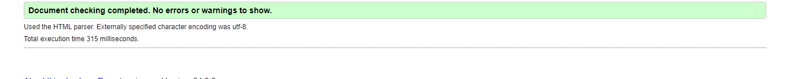
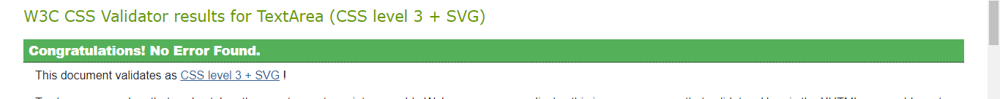

# Soul Living

Many women struggle to find holistic services that are easy to book and have regular sessions that fit around their weekly schedules, meaning it's hard for them to make time for holistic practices that can benefit their health. Soul Living was created  to help provide women with an easy access booking system to book weekly meditation and yoga sessions as well as keep track of their bookings so that they can make time for their holistic practices each week. Our primary audience is women interested in meditation, yoga and other holistic practices and are looking for a space to connect with like minded women. They may lead busy lives and find it hard to fit these practices within their weekly schedules.

## Features 

### Existing Features

- __Navigation Bar__

  - Featured on all pages, the full responsive navigation bar includes links to the Logo, Home page, Registeration and Login page and changes depending on whether a user is logged in or not offering the user a My Booking navigation instead of registration and Logout instead of Login.
  - This section will allow the user to easily navigate from page to page across all devices. 

- __Callout Register__

  - The landing includes a photograph with text overlay to allow the user to understand what the site is for and for visual appeal.
  - This section also provide a button link that takes the user to teh registration page for easy navigation.

- __Sessions Information__

  -  This section of the home page allows users to clearly understand exactly what the site and brand offers. Allows users to decide if the site is of use to them.

- __Registration Form__

  - This page allows the user to register there full name, email, and create a username and password for their SouL Living account with authentication and privacy. Their account is where they can create and manage their bookings.

- __The Footer__ 

  - The footer section includes links to the relevant social media sites. The links will open to a new tab to allow easy navigation for the user and the logo also navigates the user back to the home page. 
  - The footer is valuable to the user as it encourages them to keep connected via social media

- __Login Form__

  - Users can login through the Login page if they alreayd have an account making it quick and easy for returning users to manage their bookings ensuring authentication and privacy of deatils. 

- __Bookings Table__

  - On the My Bookings there is a booking table list of all the bookings the user has made with the option to create, edit and cancel bookings. This allows the user to easily make bookings around their busy schedules.

### Features Left to Implement

- Contact page with contact form teh posts to the admin user
- A booking schedule view in the calendar
- Change account information (e.g username, email, fullname)
- Confirmation feature before booking

## Testing 

Sufficient testing has been done manually and through validators. 

- Buttons and links work correctly apat from the callout register now button on the home page which doesnt do any action related to its content.
- The booking table in My Bookings doesnt edit or cancel bookings so not working as it should.

### Validator Testing 
- HTML
  - No errors were returned when passing all HTML template through the official W3 Validator

- CSS
  - No errors were found when passing through the official [W3 Jigsaw validator](http://jigsaw.w3.org/css-validator/validator$link)

## Deployment
 

- The site was deployed to Heroku app. 

The live link can be found here -https://yogabookings-adb857a51526.herokuapp.com/home/
Github Repo - https://github.com/tanikairwin/SoulLiving 
Project Board - https://github.com/users/tanikairwin/projects/1/views/1

## Credits 

### Content 

- The text for the Home page was taken from [ChatGPT](https://chatgpt.com/auth/login)
- The Favicon Image was created and taken from [Favicon Generator](https://favicon.io/)
- The Fonts throughout the site and icons in the footer were taken from [Font Awesome](https://fontawesome.com/)

### Media

- The photos used on the honme, login and register pages are from [Pexels](https://www.pexels.com/search/yoga/)

### Other Repositories and Help

- (https://github.com/StevenWeir038/Kennel39/blob/main/bookings/templates/bookings/view_booking.html)
- (https://github.com/flatplanet/Django-CRM)
- [Youtube Link of the video I watched that led me to the repository above](https://youtu.be/t10QcFx7d5k?si=1gf25plbYqgLbFyc)
